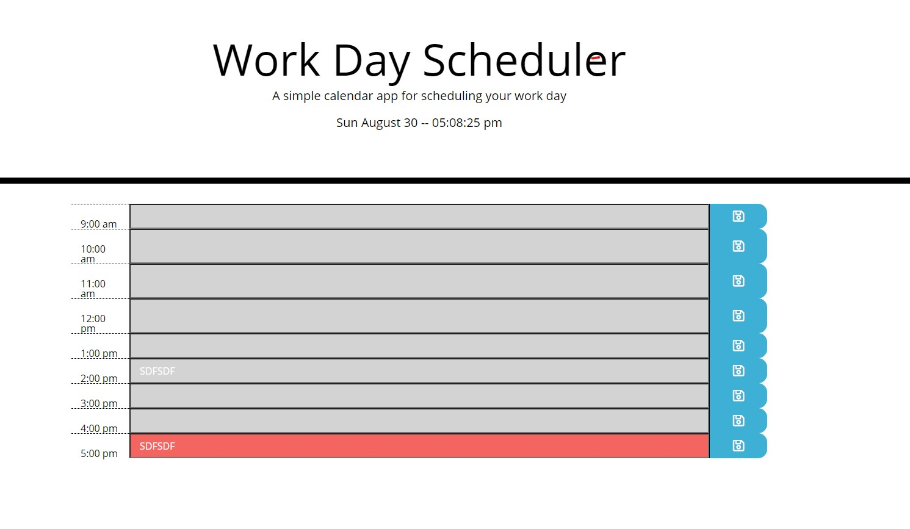

# Introduction

This simple web app will allow you to save tasks for a 9-5 work day to help you better plan your day.

## How-To

Type in a task for the desired time frame then click the save icon to the right. The web application will save your data then recall it the next time the page is visited on the same computer.

## How it works

The app's rows are created individually instead of dynamically since there is always going to be a 9-5 layout. Each row is assigned an id of row-* to be able to manipulate the data with js. The app uses MomentJS throughout its entirety since the nature of the app is to deal with date & times. MomentJS displays the current date/time at the top of the page in real time to show you current statuses. 

Moment also is used to format the times for each of the rows by saving it to a data attribute called data-time. Data-time takes the date/time format and changes it to just show hours on a 24 hour clock. This makes it easier to compare times to know if our deadline has passed. MomentJS compares the current time in a 24 hour clock vs the data-time field and applies a background color depending on how far from the deadline you are. If it's current, it'll be red. If it's in the past, it'll be gray. If it's in the future, it'll be green.

Fontawesome is used to create the save disk icons to the the right of each field. When each field's save icon is pressed, the web app takes the current field's data-hour attribute and the closest input field's value as a key, value pair.

Finally, the app recalls all information stored in the localstorage at the beginning of the script.

## Website

